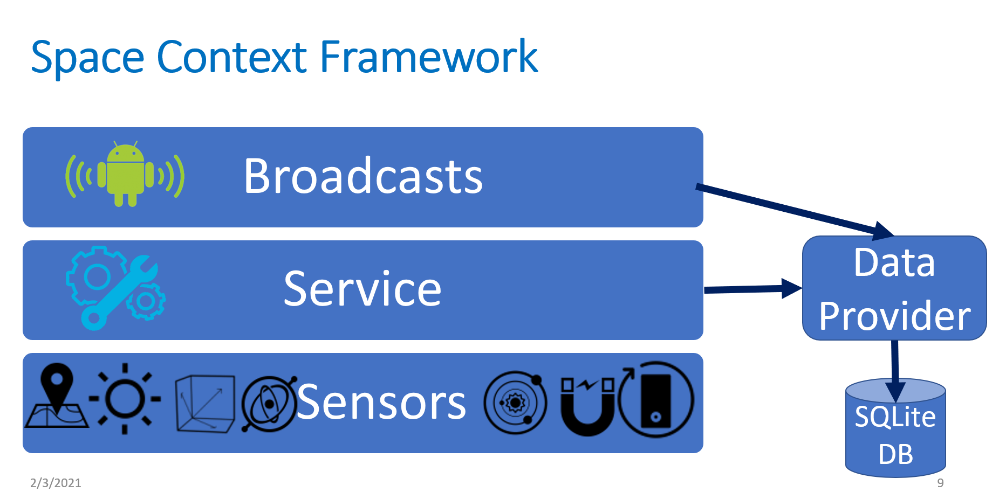

# MAR_Context

To define a virtual space, an MAR system requires to define the physical context to speed up localization.
## To define the context, we need to record the device sensor data including:
1. IMU data, GPS
2. Light sensor data (from the front of the phone).
3. AR-based Focal length and Aperture.

If extracting some data require sensor data fusion, the fusion occurs in a custom Broadcast Receiver (which collect, fuse and produce new data that is saved to DB).
The framework till now looks like:

