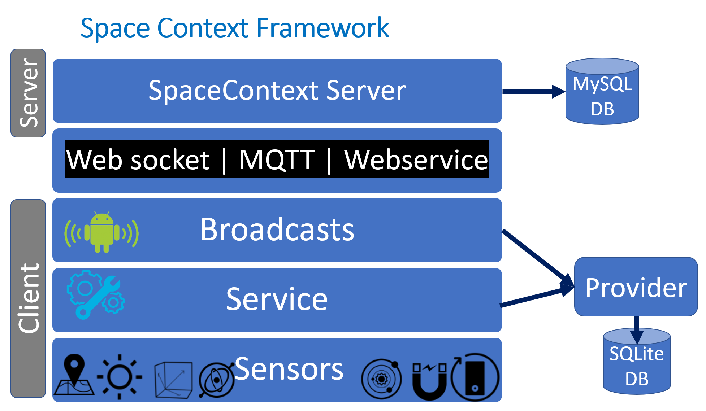

# MAR_Context

To define a virtual space, an MAR system requires to define the physical context to speed up localization.
## To define the context, we need to record the device sensor data including:
1. Logger module to determin the location, orientation of the mobile: IMU and GPS data.
2. Logger module to determine the ambient enviroment: Light, Tempreture, Pressure, Humidity sensor data.
3. (NOT IMPLEMENTED) AR-based Focal length and Aperture.

If extracting some data require sensor data fusion, the fusion occurs in a custom Broadcast Receiver (which collect, fuse and produce new data that is saved to DB).
## The current stage
The framework till now looks like:

Ambient environment's sensors also provide useful information for space recognition process.  
Night (light sensor), and seasons other than the learning season (humidity, pressure and tempereture sensors help here) affect the accuracy of the recognition or even hinder the recognition process.

## The ultimate goal
We expect ultimate framework of the virtual space context to look like:

